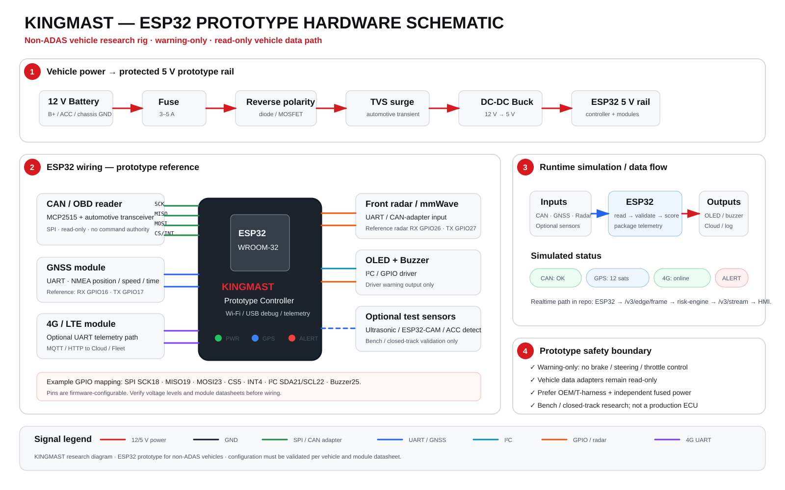

# KINGMAST

**Development version: v0.0.6**

KINGMAST is a safety-first ADAS research platform for electric vehicles. The production boundary remains **warning-only Level 0 driver assistance**: speed, forward/rear gap, THW/TTC, surround awareness, GPS positioning, road-object detection, location-aware alerts, navigation context, EV route intelligence, connected-road context, sensor health and event logging.

> Safety boundary: this repository does **not** issue steering, braking, throttle or drivetrain commands. Vehicle adapters are read-only by design. Autonomous-driving work belongs in a separate simulation-only lab.

## Current development highlights
- Apple-inspired automotive HMI with a navigation-first driver hierarchy.
- Native MapLibre map rendering with configurable production style provider and OSM demo fallback.
- Route geometry, destination, vehicle, camera and object markers in one map coordinate system.
- Route-aware traffic-camera matching with direction filtering when metadata is available.
- Camera warning bands around 1 km / 500 m / 300 m / immediate.
- Current speed-limit awareness fused from mapped road metadata and high-confidence sign vision.
- Upcoming speed-zone preview along the active route.
- Turn-by-turn maneuver urgency, advisory lane hint, route progress, remaining distance and dynamic ETA.
- Route alternatives with deterministic EV energy and projected arrival battery estimates.
- Route-aware mapped junction, crossing, roundabout and charging-station context.
- Blind-spot and low-speed rear cross-traffic advisories from fused object metadata.
- Connected-road provider abstraction for V2X/SPaT, school/construction zones, weather/road hazards, emergency vehicles, lane topology and highway exits.
- Intelligent connected-road alert suppression so collision-critical perception always owns driver attention.
- Compact connected-road HUD ribbon rather than another dashboard-style screen.
- Sustained off-route detection with cooldown-protected rerouting.
- Optional short voice prompts for turns, camera context, speed limits and rerouting.
- Moving destination-edit and route-selection lock for real vehicle sources.
- Short-lived route cache and recent destinations for degraded/offline continuity.
- Auto / Day / Night appearance modes and reduced-motion support.
- Realtime ESP32/GNSS + radar ingestion and camera detection publisher.
- Camera + radar fusion for person, car, motorcycle, bicycle, truck, bus and obstacles.
- Warning-only CI safety gate that rejects actuator-command APIs.

## ESP32 prototype hardware

The current proof-of-concept uses an ESP32-class controller for bench and closed-track experiments on vehicles that do not already provide the required ADAS sensing stack. Vehicle data access remains read-only, and the research unit uses a separately protected power path.



The diagram is a development reference, not a homologated automotive ECU or a vehicle-certified wiring harness. GPIO assignment, power conditioning, radar protocol and adapter design must be validated against the selected hardware and each target vehicle. See `docs/EDGE_REALTIME_INTEGRATION.md` for the software/data path.

## Versioning during development
KINGMAST is still in active development. Adding a feature batch does **not** automatically create a new product version. The repository stays on **v0.0.6** until an explicit release checkpoint is approved.

API paths such as `/v3`, `/v4` and `/v5` are **interface generations**, not the KINGMAST product version. Connected-road endpoints intentionally use descriptive paths instead of implying another product release. See `docs/VERSIONING.md`.

## Monorepo
```text
apps/hmi/                  Next.js automotive HMI
services/risk-engine/      Fastify risk, fusion, road-context and realtime API
packages/contracts/        Shared typed telemetry/navigation/connected-road contracts
edge/esp32/                GNSS/radar edge publisher reference firmware
edge/camera-detector/      Camera object/speed-sign metadata publisher
database/                  PostgreSQL migrations
safety/                    Safety policy and traceability
skills/ecc-plan/           Engineering Control & Compliance planning skill
docs/                      Architecture, HMI, navigation and connected-road plans
tests/scenarios/           Deterministic ADAS scenarios
autonomy-lab/              Simulation-only R&D boundary
```

## Quick start
Requires Node.js 22+, pnpm 10+, PostgreSQL 16+.
```bash
pnpm install
cp .env.example .env
pnpm dev
```
HMI: http://localhost:3000  
Risk API: http://localhost:4000

The HMI falls back to a deterministic simulator when the edge WebSocket is unavailable. **Use device GPS** requests browser geolocation for bench/mobile preview only.

## Navigation and road-context API
- `GET /v4/road-context` — current posted-speed and camera context.
- `GET /v4/navigation/search` — configurable Nominatim-compatible place search.
- `POST /v4/navigation/route` — OSRM-compatible route calculation.
- `POST /v4/perception/speed-sign` — authenticated high-confidence local speed-sign observation.
- `POST /v4/road-context/cameras` — authenticated runtime camera-provider metadata.
- `GET /v4/road-context/providers` — provider/coverage policy.
- `POST /v5/navigation/alternatives` — route alternatives and EV estimates.
- `POST /v5/navigation/intelligence` — route speed zones, junctions and charging context.

## Connected-road API
- `POST /connected-road/provider` — authenticated provider snapshot ingest for SPaT, zones, weather, emergency vehicles, lanes and exits.
- `POST /connected-road/context` — fused read-only driver context with priority suppression.
- `GET /connected-road/capabilities` — connected-road capability/policy surface.

Live SPaT and emergency-vehicle state require an explicitly authorized provider. Public maps must never be presented as live signal phase.

## Realtime API
- `POST /v3/edge/frame` — authenticated protocol-v1 ESP32 packet.
- `POST /v3/perception/radar` — radar tracks.
- `POST /v3/perception/camera` — camera class/bearing metadata; raw frames are not uploaded.
- `GET /v3/stream` — HMI WebSocket telemetry + heartbeat.
- `GET /v3/diagnostics` — edge source ages, clients and rejected-packet count.
- `GET /v3/events` — recent stable warning transitions.
- `GET /v3/geofences` / `POST /v3/geofences` — active location warning zones.
- `GET /v1/capabilities` — explicit warning-only capability boundary.

## Map configuration
For production, configure an approved vector style with:
```text
NEXT_PUBLIC_MAP_STYLE_URL=https://your-approved-style/style.json
```
If blank, KINGMAST falls back to `NEXT_PUBLIC_MAP_RASTER_TILE_URL` for demo use. Public tile endpoints must not be treated as a production SLA.

## Database
Run migrations in order:
```text
database/001_init.sql
database/002_location_object_detection.sql
database/003_edge_operations.sql
```

## Safety model
`THW = range / egoSpeed`. `closingSpeed = egoSpeed - targetSpeed`. `TTC = range / closingSpeed` only when the gap is closing. Safety decisions are timestamp/confidence aware; stale camera/radar/GNSS inputs are degraded or rejected. GPS, map, navigation and connected-road context never create vehicle-control authority.

See `docs/CONNECTED_ROAD_INTELLIGENCE.md` and `safety/CONNECTED_ROAD_WARNING_POLICY.md` for the latest feature batch.

KINGMAST is Apple-inspired but is not an official Apple CarPlay app, not AEB/ACC and not a homologated safety product.